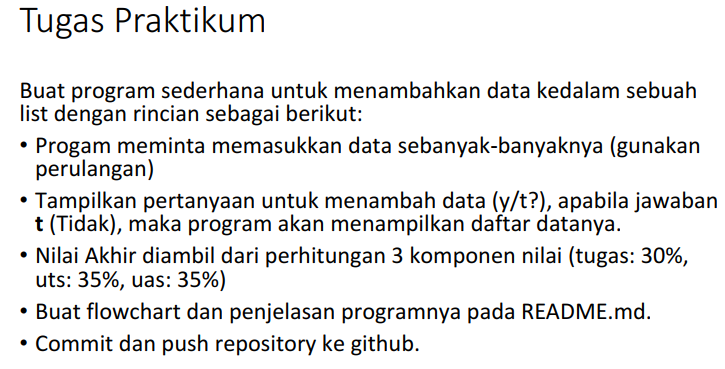
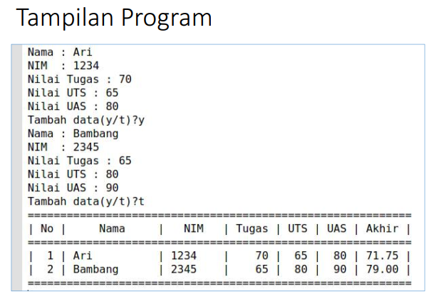
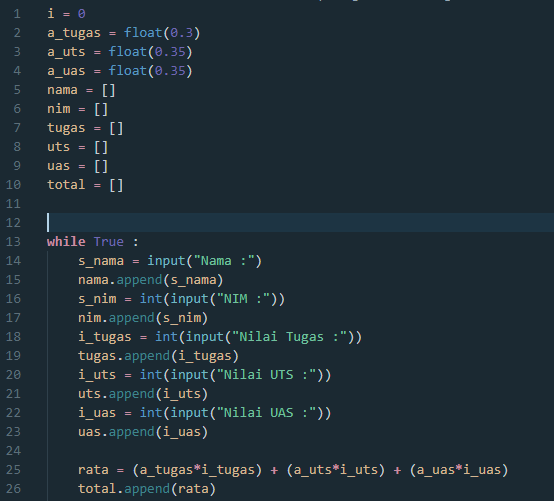
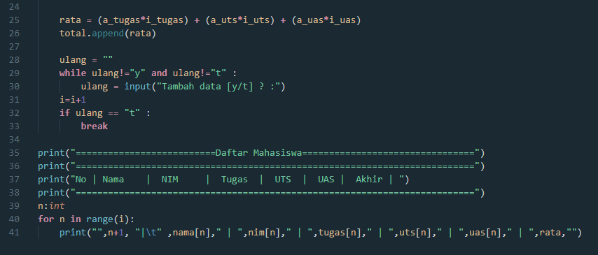
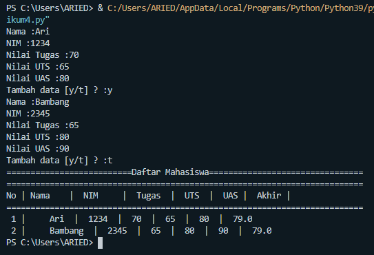

# TUGAS B.PEMOGRAMAN

Nama : M. Aqil Alfarid
Kelas : TI.20.B.1
NIM : 312010140 

# TUGAS PRATIKUM 4

Pada tugas kali ini, saya akan mengerjakan soal dari Dosen Pembimbing saya.

Berikut Soal nya :

Jika sudah membaca dan memahaminya lanjut berikut adalah contoh hasil outputnya :

Okeee, lanjut kita akan membaut Codingan/Program sesuai dengan Contoh Soal. Berikut contohnya :

Jika sudah , kita lakukan RUN dan lihat hasilnya.

Bila sudah selesai dan berhasil. Maka kita lanjut dengan pembahasan dari Program/Codingan Tugas kali ini.

Keterangan:

- Karena kita akan menggunakan list jadi kita buat dulu list kosongnya(kenapa kosong??karena kita akan mengisi list tersebut dengan inputan data para siswa/i)

- float digunakan jika kita ingin menginputkan angka yang menggunakan tanda koma(,) atau bisa juga untuk menghitung pembagian yang menghasilkan koma(,)

- i = 0 itu untuk kita gunakan berapa banyak nih data siswa/i yang ingin kita inputkan nanti

- Setelah itu kita akan menggunakan perulangan while True untuk menginputkan data siswa/i

- Disini kita menggunakan append untuk menambahkan anggota atau data siswa/i ke dalam list kosong tadi

- Lalu kita menggunakan perulangan while lagi gunanya untuk memberi pertanyaan apakah kita akan menginputkan data siswa/i lagi? jika 'y' maka kita menambah data jika 't' kita tidak akan menambah data

Sekian penjelasan tentang materi kali ini. 
